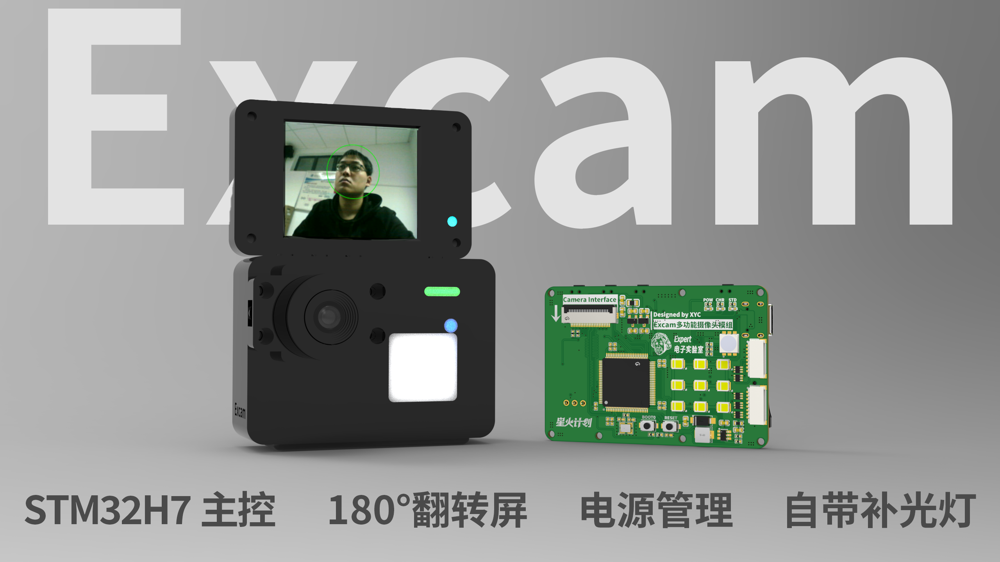
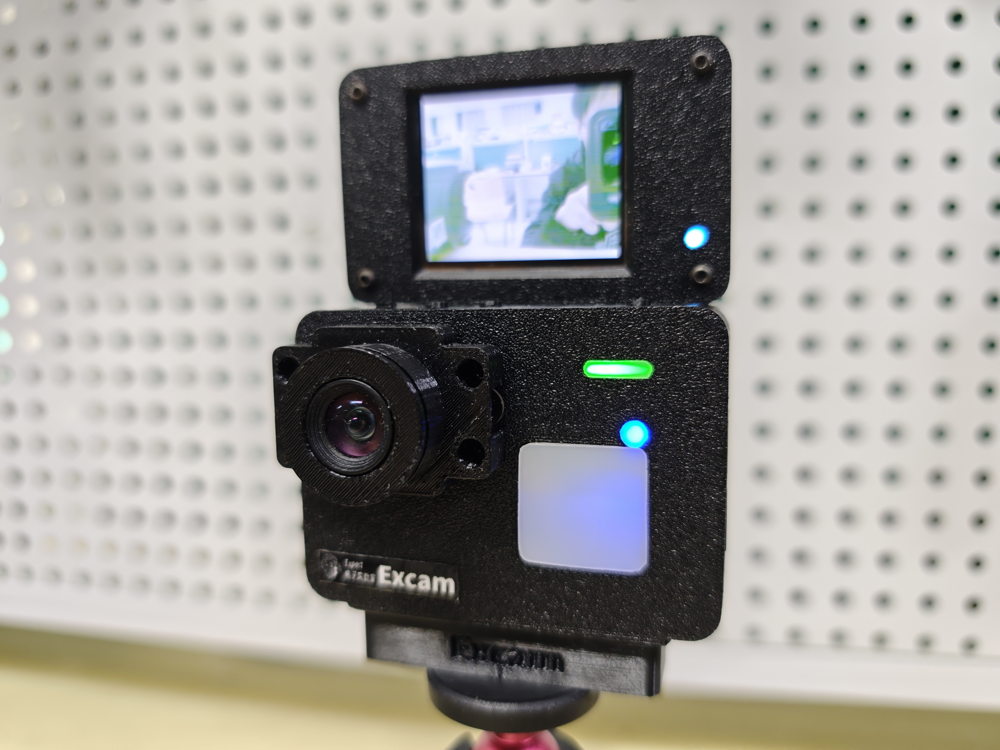
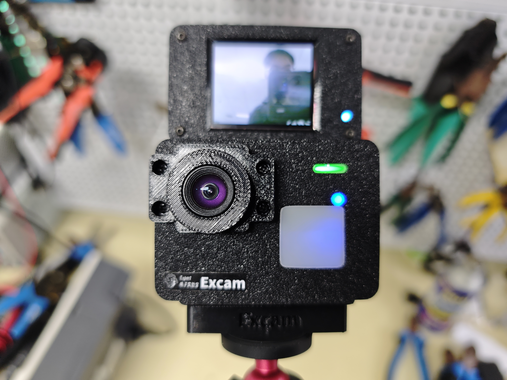
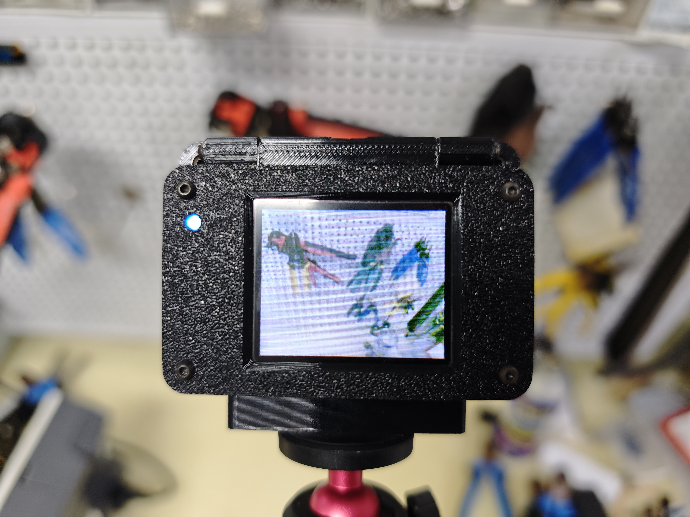
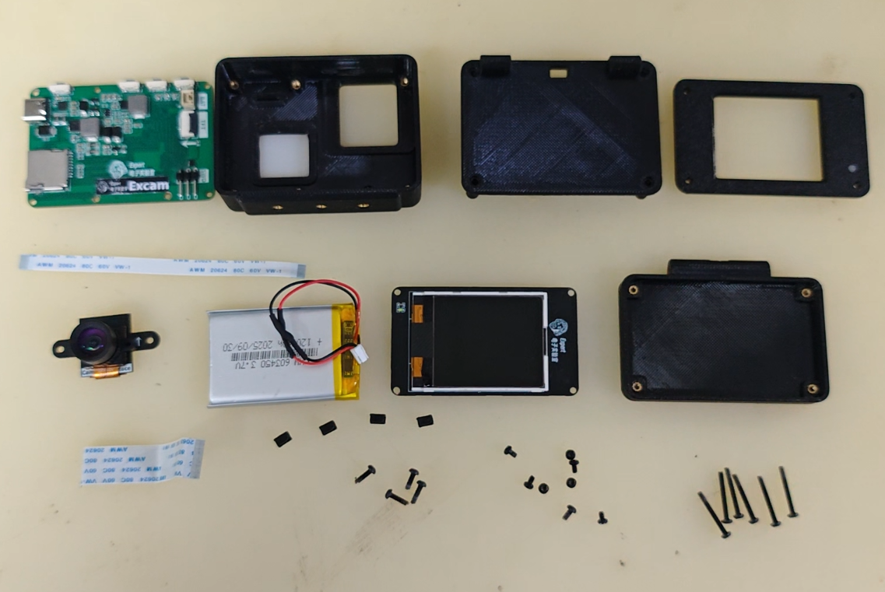
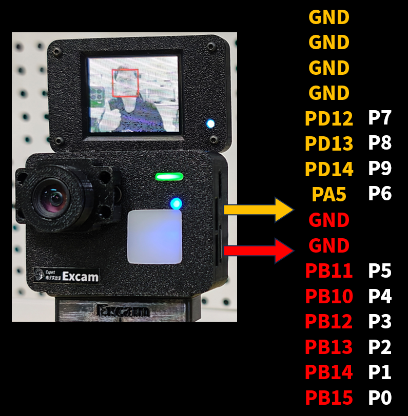
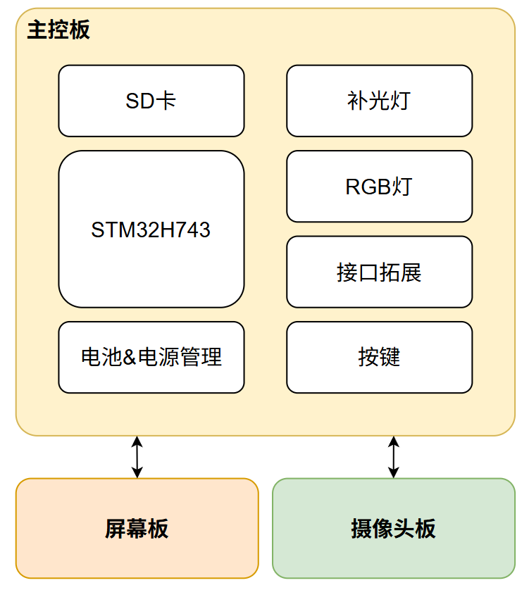
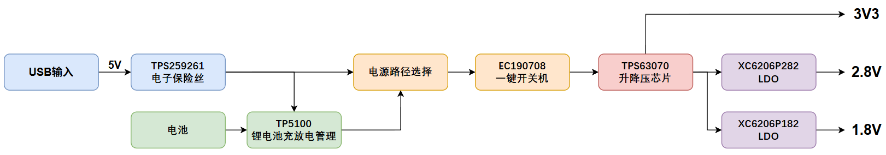
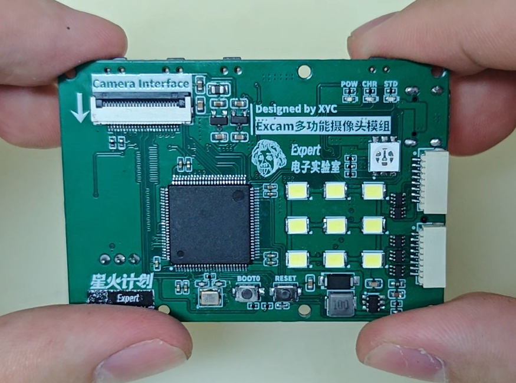
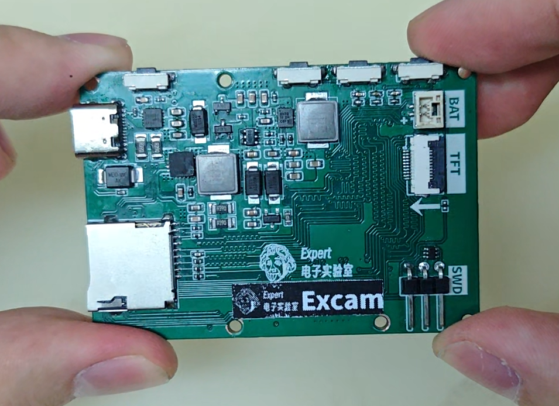

# Excam是一款基于openmv的多功能小相机
## Excam主控采用stm32h7343（stm32h750），搭载1.8寸180°翻转屏，电池，补光灯，RGB灯，按键，SD卡，支持OV5640、OV2640摄像头，支持引脚拓展，兼容openmv固件（引出SWD接口），可以实现色块识别、人脸识别、边缘检测、模板匹配、特征点检测等功能，可以跑一些简单的神经网络模型。

## B站视频链接：
## 资料链接：
# 产品渲染图

# 产品实物图

## 外观

## 所有部件一览

# 硬件说明
## 排针引脚功能（通过侧面SH1.0的接口引出，可以外接杜邦线或者排线）：

## 系统框图：

## 系统电源树：

电源的输入端首先经过TI的TPS259261电子保险丝进行防护，电子保险相较于传统的保险丝方案，支持防过压防反接缓启动等综合防护功能。

锂电池充放电管理采用国产开关型充电ICTP5100，支持最大2A的充电电流，配合TI的TPS63070升降压芯片可以实现稳定的电源输出。

采用一键开关机芯片EC190708，长按三秒开机，之后长按三秒关机，以此类推配合电源路径选择电路，可以实现电源输入的自动切换，即使电源突然掉电也可以保证系统的稳定工作。

对于补光灯的驱动电路，我采用了TI的TPS61165恒流源方案，相比于mos直接驱动的方案，恒流源可以有效维持电流恒定，保证led稳定发光，此外TPS61165还支持pwm亮度调整，我们可以很方便的调整补光灯的亮度。

## PCB结构：
项目由三块PCB构成，主控板为四层板，屏幕板、摄像头板为两层板，采用模块化设计，通过fpc软排线连接。

# 结构说明

调试器外壳采用3D打印制作，总共需要打印五个部分：顶壳，底壳，镜头保护盖，开关，拓展模块，需要用电烙铁压入M2热熔螺母配合M2螺丝进行固定。

# 固件下载和烧录
硬件焊接组装好之后，需要烧录openmv的固件：

1.下载STM32CubeProgrammer，下载地址：https://www.st.com/en/development-tools/stm32cubeprog.html

2.使用数据线连接Excam和电脑，按住boot键上电，打开设备调试器可以看到一个DFU设备

3.打开STM32CubeProgrammer，依次点击usb连接，选择openmv固件下载，推荐下载4.6.0版本的固件，也就是我发的压缩包里的固件

4.点击download，看到success之后说明烧录完成

5.重新上电连接openmvIDE就可以正常使用了

# 软件使用说明

# 参考资料
OpenMV：https://github.com/openmv
CloseMV:https://oshwhub.com/bigbirdzzz/closemv4
补光灯方案：https://oshwhub.com/xu_duoduo/heng-liu-yuan-3-3led-bu-guang-deng

